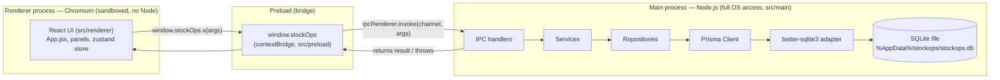
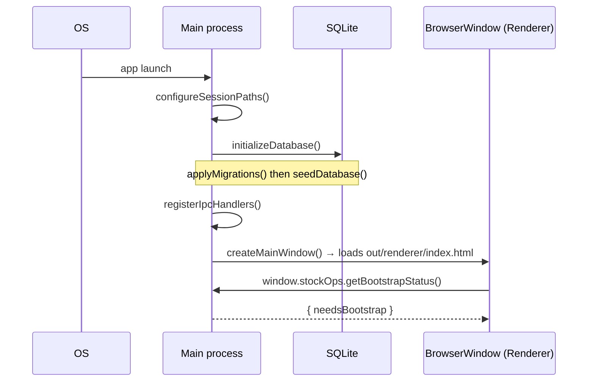
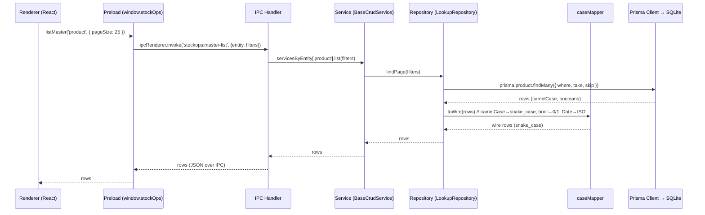
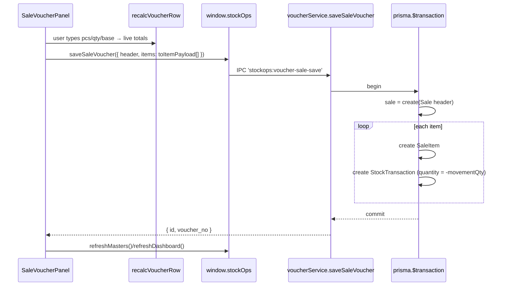
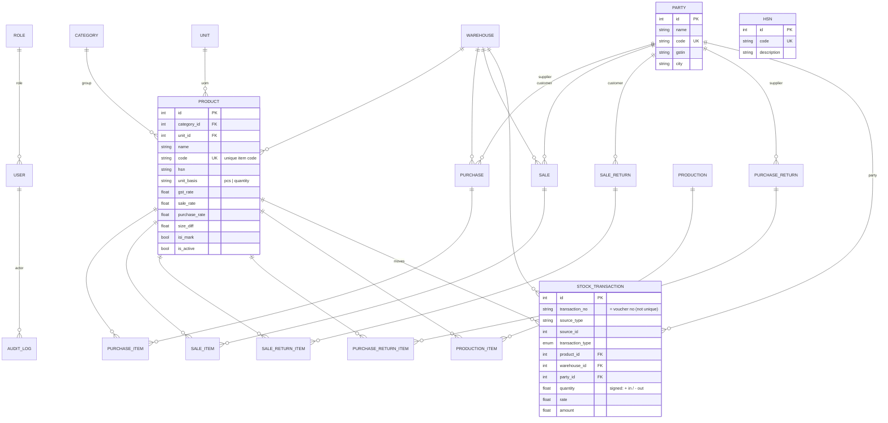

# StockOps — Architecture & Database Guide

StockOps is an **offline desktop stock‑management system** for a small manufacturing
business. It runs as a single **Electron** app (no server, no internet) with a local
**SQLite** database. This document explains how the whole thing fits together and
documents the database in detail.

> Diagrams below are written in [Mermaid](https://mermaid.js.org/). They render on
> GitHub and in most Markdown viewers/IDE extensions. If yours doesn't render them,
> the surrounding text still describes everything in words.

---

## 1. What the app does

- **Masters** (reference data you set up once): Stock Items (products), Parties
  (customers/suppliers/brokers), Groups (categories), Units of Measure (UOM),
  HSN codes, Warehouse.
- **Vouchers** (day‑to‑day transactions): Purchase, Sale, Sale Return,
  Purchase Return, Production (issue/produce).
- **Reports & views**: Dashboard, Daily Stock Summary, Item Stock Ledger.
- Every voucher ultimately writes **stock movements** into one ledger table, and the
  current stock of any item is simply the **sum** of those movements.

---

## 2. Tech stack

| Concern            | Choice                                                            |
|--------------------|-------------------------------------------------------------------|
| Desktop shell      | **Electron 34**                                                   |
| Build/bundling     | **electron‑vite** (Vite 6) — separate builds for main/preload/renderer |
| UI                 | **React 18**, **react‑hook‑form**, **zod** (validation), **zustand** (state) |
| ORM                | **Prisma ORM v7** (`prisma-client` generator → `src/generated/prisma`) |
| DB driver          | **@prisma/adapter-better-sqlite3** + **better-sqlite3** → **SQLite** file |
| Auth               | **bcryptjs** (password hashing)                                   |
| Reports            | **exceljs**, **pdfkit**, **csv-stringify**                        |
| Packaging          | **electron-builder** (Windows NSIS installer)                     |

---

## 3. The three‑process model (Electron)

Electron apps have three distinct execution contexts. Keeping them separate is the
single most important idea in this codebase.



- **Renderer** (`src/renderer`) is the React app. It is **sandboxed** and cannot touch
  the filesystem or database directly. It only knows about `window.stockOps`.
- **Preload** (`src/preload`) runs with limited privileges and uses `contextBridge`
  to expose a **safe, fixed API** (`window.stockOps`) to the renderer. Each method is a
  thin wrapper around `ipcRenderer.invoke(channel, payload)`.
- **Main** (`src/main`) is a normal Node process. It owns the database, business logic,
  file exports, backups, etc. It answers IPC calls via `ipcMain.handle`.

**Why this split?** Security and stability. The UI can't run arbitrary Node code, so a
bug or malicious script in the renderer can't read your disk. All privileged work goes
through a small, explicit set of IPC channels.

### Startup sequence (`src/main/index.js`)



---

## 4. Directory structure

```
code/
├─ electron.vite.config.js      # 3 build targets: main, preload, renderer
├─ prisma/
│  ├─ schema.prisma             # single source of truth for the DB schema
│  └─ migrations/               # generated SQL migrations (applied at runtime)
├─ src/
│  ├─ main/                     # MAIN PROCESS (Node)
│  │  ├─ index.js               # app entry: window, startup, migrate+seed
│  │  ├─ db/
│  │  │  ├─ database.js         # Prisma client singleton + adapter
│  │  │  ├─ migrate.js          # applies migration.sql files at runtime
│  │  │  ├─ seed.js             # seeds roles/settings/groups + UOM + HSN
│  │  │  └─ data/{uom,hsn}.json # bundled seed data (45 UOMs, ~21k HSN)
│  │  ├─ ipc/handlers.js        # maps IPC channels → services
│  │  ├─ services/              # business logic (auth, lookups, vouchers, inventory)
│  │  ├─ repositories/          # data access (Prisma queries + case mapping)
│  │  ├─ reports/, backup/      # exports and DB backup
│  │  └─ utils/                 # errors, validation, logger, caseMapper
│  ├─ preload/                  # PRELOAD (bridge)
│  │  ├─ index.js
│  │  └─ api.js                 # defines window.stockOps
│  ├─ renderer/                 # RENDERER (React)
│  │  ├─ main.jsx, App.jsx
│  │  ├─ components/            # panels + reusable widgets
│  │  ├─ stores/sessionStore.js # zustand state
│  │  ├─ config/navigation.js   # sidebar structure
│  │  └─ utils/                 # form/grid keyboard nav, voucher row calc, dates
│  ├─ shared/                   # used by BOTH main and renderer
│  │  ├─ ipcChannels.js         # channel name constants
│  │  └─ itemCode.js            # item-code builder (name/size/length)
│  └─ generated/prisma/         # generated Prisma client (gitignored)
└─ docs/ARCHITECTURE.md         # this file
```

---

## 5. How a request flows (the layers)

Everything the UI needs goes through the same pipeline. Example: “load all stock items”.



**Layer responsibilities**

| Layer | Files | Job |
|-------|-------|-----|
| IPC handler | `ipc/handlers.js` | Route a channel to the right service method. No logic. |
| Service | `services/*.js` | Business rules, validation (zod), transactions. |
| Repository | `repositories/*.js` | Data access via Prisma; converts case at the boundary. |
| Case mapper | `utils/caseMapper.js` | Prisma uses **camelCase**; the UI/IPC contract uses **snake_case**. `toWire`/`fromWire` translate. |
| Prisma + adapter | `db/database.js` | Talks to SQLite through better‑sqlite3. |

### Case mapping (important, non‑obvious)

- Prisma models are **camelCase** (`unitBasis`, `isActive`, `createdAt`).
- The database **columns** are **snake_case** (`unit_basis`, `is_active`) via `@map`.
- The **renderer/IPC contract** is also **snake_case** (`unit_basis`, `is_active`) and
  represents booleans as `1/0` for the legacy UI.
- `fromWire()` (snake→camel) is applied before writing; `toWire()` (camel→snake,
  `Date`→ISO string, boolean→`0/1`) is applied after reading. This lets the whole
  frontend stay on the original snake_case contract while the backend uses Prisma’s
  camelCase models.

### Errors

- `utils/errors.js` defines `AppError` (message, code, HTTP‑ish status).
- `repositories/baseRepository.js` catches Prisma **P2002 (unique constraint)** and
  rethrows a friendly `AppError` (e.g. “Item code already exists.”).
- Thrown errors travel back over IPC and reject the renderer’s `await`, so panels can
  show them inline.

---

## 6. The renderer (React) in brief

- `main.jsx` mounts `App.jsx`. `App.jsx` reads/writes the **zustand** store
  (`stores/sessionStore.js`): `user`, `products`, `parties`, `categories`, `units`,
  `dashboard`, `vouchers`, `activeView`, `busy`, `error`.
- On login, `App.jsx` calls `refreshMasters()` and `refreshDashboard()` which pull data
  through `window.stockOps`. HSN (~21k rows) is **not** preloaded — it is searched on
  demand.
- `AppShell.jsx` renders the **collapsible sidebar** (navigation from
  `config/navigation.js`) and the active panel.
- Panels: `StockMasterPanel`, `PartyMasterPanel`, `CodesUnitsPanel` (HSN + UOM),
  the five voucher panels, `DashboardView`, `DailyStockSummaryPanel`, `ItemLedgerPanel`.
- Reusable UI/logic utils:
  - `utils/formKeyNav.js` — Enter/arrow navigation across ordinary form fields
    (geometric: Enter/→ move right & wrap to next row; dropdowns open on landing).
  - `utils/gridKeyNav.js` — the same idea for voucher item grids (Up/Down between rows,
    Left/Right at the caret edge, Enter to add a row).
  - `utils/voucherRow.js` — the **shared voucher line calculation** (see §7).
  - `components/HsnSelect.jsx` — async searchable HSN picker (queries the DB as you type).

---

## 7. Core domain concepts

### Stock ledger = single source of truth

There is **no “current stock” column** anywhere. Instead, every inflow/outflow is a row
in **`stock_transactions`** with a signed `quantity` (positive = in, negative = out).
The stock of a product in a warehouse is:

```
balance = SUM(quantity) WHERE product_id = ? AND warehouse_id = ? AND deleted_at IS NULL
```

This is what `inventoryService.getStockBalance`, the dashboard, the item ledger, and the
daily summary all compute from.

### Item measurement basis (pcs **or** quantity)

Each stock item is measured by **either pieces or quantity**, stored as
`products.unit_basis` (`'pcs' | 'quantity'`). In every voucher grid:

- selecting a product auto‑fills HSN, GST, base rate (sale or purchase rate), size diff,
  and the basis; the **non‑basis column is disabled**;
- `taxable = (pcs or quantity, per basis) × net rate`, where `net rate = base + size diff`;
- the **stock movement uses the basis value** (`quantity` if set, else `pcs`).

This logic lives once in `utils/voucherRow.js` (`recalcVoucherRow`, `applyProductToRow`,
`toItemPayload`) and is shared by all five voucher panels so they behave identically.

### Item code

Auto‑generated from `name / size / length` (missing parts dropped, spaces → `_`,
e.g. `Steel Sheet` + `4x8` + `8ft` → `Steel_Sheet/4x8/8ft`). It is **unique** and can be
overridden. Shared logic in `src/shared/itemCode.js`.

### Opening stock

When a stock item is created with an opening quantity, the app writes an
`opening_balance` row into `stock_transactions`. The Daily Stock Summary shows these in
the **Opening** column (not as a normal inflow).

### Voucher save flow (example: Sale)



Each voucher type follows the same shape:

| Voucher          | Header table        | Line table              | Stock movement (`transaction_type`, sign) |
|------------------|---------------------|-------------------------|--------------------------------------------|
| Purchase         | `purchases`         | `purchase_items`        | `purchase` (**+**)                         |
| Sale             | `sales`             | `sale_items`            | `sale` (**−**)                             |
| Sale Return      | `sale_returns`      | `sale_return_items`     | `sale_return` (**+**)                      |
| Purchase Return  | `purchase_returns`  | `purchase_return_items` | `purchase_return` (**−**)                  |
| Production        | `production`        | `production_items`      | `production_out` (**−**) and/or `production_in` (**+**) |

All line movements from one voucher share the same `transaction_no` (= the voucher no)
and are additionally linked by `source_type` + `source_id`.

---

## 8. Database — detailed

### 8.1 Engine, location, and access

- **SQLite**, one file per installation at
  `%AppData%/stockops/stockops.db` (Windows) — i.e. Electron’s `userData` folder.
  WAL journaling and foreign keys are enabled.
- Accessed **only** from the main process through Prisma v7 + the better‑sqlite3
  driver adapter (`src/main/db/database.js`, `getPrismaClient()`).

### 8.2 Migrations at runtime (no `prisma migrate deploy`)

A packaged desktop app can’t shell out to the Prisma CLI, so migrations are applied by
our own code:

- `prisma/migrations/*/migration.sql` are the standard Prisma‑generated SQL files.
- On startup, `db/migrate.js` opens the SQLite file with a raw better‑sqlite3 connection,
  creates a `_prisma_migrations` bookkeeping table, and runs any **not‑yet‑applied**
  `migration.sql` in order (each inside a transaction).
- This is deterministic and offline. To change the schema during development you still
  use `npx prisma migrate dev` (which writes a new folder under `prisma/migrations/`);
  that folder then ships in the app and is applied on the user’s next launch.

Current migrations:

| Order | Folder                                   | What it does |
|------:|------------------------------------------|--------------|
| 1 | `..._init`                                   | Creates all tables + indexes. |
| 2 | `..._stock_party_purchase_revamp`            | Adds HSN master, extends Product, drops `Party.type`, adds `purchase_items.product_name`. |
| 3 | `..._stocktxn_no_not_unique`                 | Drops the UNIQUE index on `stock_transactions.transaction_no` (so a voucher can write several line movements under one number). |

### 8.3 Seeding (`db/seed.js`)

Runs (idempotently) after migrations on every launch:

- `roles` (Admin/Manager/Operator/Viewer), the singleton `settings` row,
  the three **Groups** as categories (Raw Material / Work in Progress / Finished Goods),
  and the default `Main Warehouse`.
- **UOM**: 45 units parsed from `db/data/uom.json` (from `UOM.xlsx`, format `SYMBOL-NAME`).
- **HSN**: ~21,745 codes from `db/data/hsn.json` (from `HSN.xlsx`), inserted in batches;
  guarded so it only runs when the table isn’t already populated.

Both JSON files are bundled into the main bundle at build time.

### 8.4 Entity–relationship diagram



> `HSN` is a standalone master used to populate the searchable HSN picker;
> `products.hsn` stores the chosen code as a denormalized string (so an item keeps its
> HSN even if the master entry changes).

### 8.5 Tables

**Identity / config**

- `roles` — role name/code + a JSON permission list.
- `users` — local accounts (single‑user “bootstrap” on first launch). `password_hash`
  is bcrypt. FK → `roles`.
- `settings` — one row (`id = 1`): company name, feature toggles, backup interval,
  and `production_settings_json`.
- `audit_logs` — action trail (actor, action, entity, JSON payload).

**Masters**

- `categories` — used as **Groups** (Raw Material / WIP / Finished Goods).
- `units` — Units of Measure (name, code, symbol).
- `hsn_codes` — HSN master (code + description); ~21k seeded rows.
- `warehouses` — stock locations (one default).
- `parties` — customers/suppliers/brokers (the `type` column was removed; a party can
  play any role). Fields: name, code, gstin, address, city, district, state, pin, mobile.
- `products` — **stock items**. Key fields: `category_id` (group), `unit_id` (UOM),
  `name`, `code` (unique), `hsn`, `size`, `length`, `unit_basis` (`pcs|quantity`),
  `gst_rate`, `sale_rate`, `purchase_rate`, `size_diff`, `batch_no`, `description`,
  `opening_stock_date`, `isi_mark`, `is_active`, `min_stock`.

**Voucher headers + lines** (one header → many item rows)

- `purchases` / `purchase_items` (line has extra `product_name`)
- `sales` / `sale_items`
- `sale_returns` / `sale_return_items`
- `purchase_returns` / `purchase_return_items`
- `production` / `production_items` (issued vs produced qty/pcs)

Header rows carry party, warehouse, dates, voucher/invoice numbers, and rolled‑up
`taxable_value` / `gst_amount` / `total_amount`. Line rows carry per‑item pcs, quantity,
rates, and computed values.

**The ledger**

- `stock_transactions` — every stock movement, the source of truth for balances.
  `transaction_type` is an enum: `purchase, sale, sale_return, purchase_return,
  production_in, production_out, adjustment_in, adjustment_out, transfer_in,
  transfer_out, opening_balance`. `quantity` is signed. Indexed on
  `(product_id, warehouse_id, transaction_type, created_at)` for fast balance queries.

**Soft deletes:** most tables have a `deleted_at` column; “deleting” sets it, and all
reads filter `deleted_at IS NULL`.

### 8.6 Conventions summary

- Table names: snake_case plural (via Prisma `@@map`).
- Columns: snake_case (via `@map`); Prisma model fields are camelCase.
- Primary keys: `id` autoincrement. Business keys (`code`, `voucher_no`) are unique.
- Timestamps: `created_at` / `updated_at`; soft delete via `deleted_at`.

---

## 9. Build & packaging

- `npm run dev` — electron‑vite dev server with hot reload.
- `npm run build` — builds `out/main`, `out/preload`, `out/renderer`.
- `npm run dist` — build + **electron‑builder** → `release/StockOps Setup 1.0.0.exe`
  (per‑user NSIS installer). `npm run dist:dir` produces an unpacked folder for quick testing.
- `prisma/migrations/**` and the seed JSON (bundled in `out/main`) are included in the
  package so the DB can be created and upgraded on the user’s machine with no tooling.

**Native module note:** `better-sqlite3` is a native addon compiled for **Electron’s**
ABI (via `electron-builder install-app-deps`). It therefore can’t be loaded by plain
Node/Vitest — the authoritative way to exercise the DB layer is the running Electron app.

---

## 10. Key design decisions (and why)

- **Ledger, not counters.** Stock is derived by summing signed movements, so history is
  always consistent and auditable; there’s no counter to get out of sync.
- **One shared voucher calculation.** All voucher grids use `utils/voucherRow.js`, so a
  fix (e.g. pcs‑vs‑quantity taxable) applies everywhere at once.
- **snake_case wire + camelCase ORM.** `caseMapper` keeps the large existing frontend on
  its original contract while adopting Prisma’s camelCase models underneath.
- **Runtime migrations.** `migrate.js` applies Prisma’s SQL migrations without the CLI,
  which is required inside a packaged desktop app.
- **HSN is searched, not preloaded.** 21k codes would make a normal dropdown unusable, so
  the picker queries the DB as you type; only the 45 UOMs are loaded up front.
